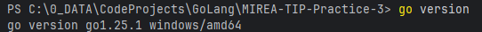
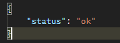
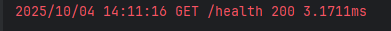
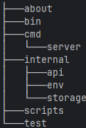

# Практическая работа №3
## Выполнил: Туев Д. ЭФМО - 01

# Описание проекта
Данный проект предназначен для изучения основ построения структуры приложений, разрабатываемых на Go

# Требования к проекту
- Предусмотрена возможность свободного клонирования с Git
- Сборка и компиляция выполняется успешно
- При обращении к handler'у в консоли пишутся логи

# Для разработчика
## Версия
Версия Go в проекте используется следующая:


## Сборка
Для сборки проекта необходимо выполнить команду из директории pz3-http:
```
go build -o .\bin\server.exe  .\cmd\server
```

## Запуск
Для запуска без компиляции выполняется команда из директории pz3-http:
```
go run ./cmd/server
```
## Переменные окружения
Для изменения порта запуска приложения необходимо указать необходимый порт в переменных окружения,
по умолчанию приложение стартует на 8080 порту:
```
$env:PORT=8081; go build -o .\bin\server.exe  .\cmd\server
$env:PORT=8081; go run ./cmd/server
```

## Скрипты
Скрипты для сборки и запуска представлены в Makefile в директории "scripts"

## Проверка работоспоcобности
Для проверки работоспособности необходимо обратиться к разворачиваемому API по эндпоинту GET /health, сервер должен 
вернуть следующий ответ: 



При таком порядке запросов логи будут следующие:



## Запросы - ответы
Сервер поддерживает следующие [запросы](https://lively-flare-564043.postman.co/workspace/My-Workspace~fe2081e8-b325-4776-8b48-400d41f5b4bd/collection/42992055-92118d31-b46d-4dbf-b3ab-1899c31461b1?action=share&source=copy-link&creator=42992055):
- GET /health — возвращает {"status":"ok"}.
- GET /tasks — возвращает список задач, поддерживает фильтр ?q=.
- POST /tasks — создаёт задачу по {"title":"..."}.
- GET /tasks/{id} — возвращает одну задачу.
- PATCH /tasks/{id} — для изменения флага done на "true".
- DELETE /tasks/{id} — для удаления задачи из InMemoryRepo по id, возвращает удаляемую задачу.

Структура запросов, а также их наполнение представлено в формате JSON в файле [Requests.md](pz3-http/about/Requests.md)

## Валидация
### Валидация данных
В рамках Middleware реализована валидация заголовка задачи, длина заголовка должна удовлетворять
следующему требованию: 

3 <= title.length <= 140

### Валидация запросов (CORS)
В рамках Middleware реализована логика CORS - валидации: 
сервер ожидает заголовки Access-Control-Allow-Origin: * для GET/POST 

# Структура проекта

